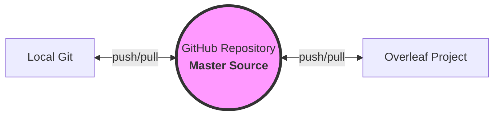
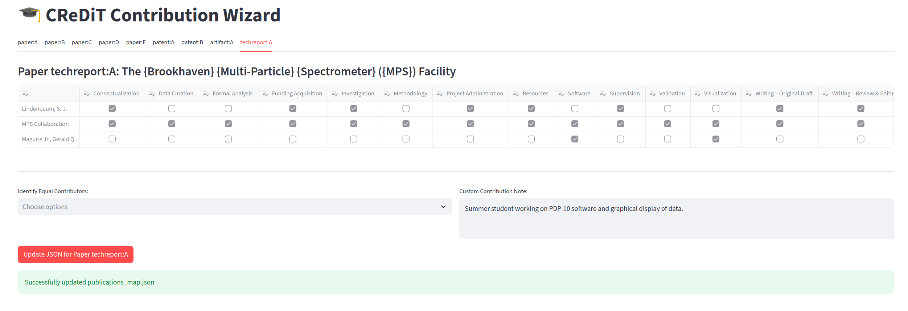

# KTH 3rd Cycle Thesis Template (Restructured)
**An unofficial-but-highly-functional LaTeX framework for KTH Doctoral Students.**
<p align="center">
<a href="#basic-usage">📖 Basic Usage</a> |
<a href="#key-files-at-a-glance">📂 Key Files</a> |
<a href="#advanced-setup-automation">🚀 Advanced Setup & Automation</a> |
<a href="#for-more-advanced-users">👨‍💻 For more advanced users</a> |
<a href="#enhancements-and-workflows">🤖 Enhancements and Workflows</a> |
<a href="#troubleshooting">🩺 Troubleshooting</a> |
<a href="#aims">🎯 Aims</a> |
<a href="#core-features">✨ Core Features</a> |
<a href="#contributing-and-feedback">💬 Contributing and Feedback</a>
</p>

This Overleaf project is for the LaTeX template called "KTH 3rd cycle template restructured," designed by Gerald Q. Maguire Jr. for use by third-cycle students (i.e., doctoral students - be they licentiate or Ph.D. students) at KTH. One of the main goals of this project is to support all phases of the thesis (process) and all the different *readers* (be they human or machine).

> [!NOTE]
> This template is not an official template; it has been developed to try to address the weakness of the existing templates while trying to be consistent with the graphical design.

# The "3-Minute Setup" summary
1. **Fork/Clone** Repo - to create your personal workspace.
2. **Run** scripts/config_wizard.py - enter your metadata.
3. **Create** a new project in Overleaf and **Import from GitHub** - synchronize with GitHub
4. **Start writing** with a working template.

<a id="basic-usage"></a>
## Basic Usage
A student should begin by reading the `Quick_Start_Guide` (.tex or .pdf) file. This three-page guide gives the four most important steps to get started.

The `README_3rd_cycle_author` (.tex or .pdf) file provides information the student will want to know about working with the template.

Most students will only need to configure their thesis-specific values (author information (name, KTHID, ...), supervisors, titles, etc.) in custom_configuration, and then can start turning the file examplethesis.tex into their thesis. Acronyms should be added to the file `lib/acronyms.tex`. If you need to include additional LaTeX libraries, look at `lib/includes.tex` or `lib/includes-after-hyperref.tex` (the latter file is for packages that must be loaded after hyperref).

At the top of examplethesis.tex you will see that it is easy to configure (within \documentclass) whether your thesis is being written in English or Swedish, which bibliographic tool you want to use, whether you are including publications (for a compilation style thesis) or not, and what languages of abstracts you want to have (beyond the required English and Swedish abstracts and keywords).

<a id="key-files-at-a-glance"></a>
### Key Files at a Glance
While there are large number of files and folders - it is very likely that you can ignore most of them.
The following are those that are most interesting:

| File | Purpose |
| :--- | :--- |
| **Quick_Start_Guide.pdf** | **Read this first.** A 3-page guide to get you started. |
| **README_3rd_cycle_author.tex** | A guide for the author. |
| **examplethesis.tex** | Your main document. Start writing here. |
| **custom_configuration.tex** | Personal info: Name, KTHID, supervisors, and titles. |
| **lib/acronyms.tex** | Define all your abbreviations here. |
| **lib/includes.tex** | Add your LaTeX packages/libraries here. |
| **lib/includes-after-hyperref.tex** | Add LaTeX packages/libraries here that must be loaded after the hyperref package, e.g., packages like cleveref. |
| **errata.tex** | Use this to generate an errata sheet if errors are found *after* printing. |


<a id="advanced-setup-automation"></a>
## Advanced Setup & Automation
To leverage the automation features, you should establish a workflow between your local machine, GitHub, and Overleaf. For information about GitHub and Overleaf integration see [GitHub synchronization](https://docs.overleaf.com/integrations-and-add-ons/git-integration-and-github-synchronization/github-synchronization)

### 1. Repository Setup
1. **Create your own Repository:** It is recommended to create a new private repository on GitHub to host your thesis.
2. **Clone & Push:**
   * Clone this template repository to your local machine:
     ```bash
     git clone https://github.com/gqmaguirejr/KTH-3rd-cycle-template-restructured.git
     ```
   * Change the "remote" to point to your new personal repository:
     ```bash
     git remote set-url origin https://github.com/YOUR_USERNAME/YOUR_REPO_NAME.git
     ```
   * Push the content: `git push -u origin main`

### 2. Establish Overleaf Integration
1. In Overleaf, create a **New Project** and select **Import from GitHub**.
2. Select your newly created repository.
3. Overleaf is now "coupled" to your GitHub repository. You can push changes from Overleaf to GitHub using the **Menu > GitHub** sync feature.

### 3. Synchronized Workflow
Because GitHub Actions automatically commit changes back to your repository (such as the generated publication list), you must synchronize your local Git, your GitHub Repository, and your Overleaf project:


	      	  		  	 
* **Overleaf:** Best for writing & previewing your thesis text. Once you have finished a section, use the Overleaf menu to **Push** your changes to GitHub (**Menu** > **GitHub** > **Push**).
* **GitHub:** Master Source & Automation ; for example,  when you have added new records in DiVA for your publications: **Actions** > **Manual DiVA Discovery Test** workflow
* **Local machine:** Setup & Power Tools; for example, (1) streamlit run config_wizard.py or streamlit run ./scripts/CReDiT_Matrix_Wizard.py, (2) editing/managing the `publications_map.json` file, (3) debugging scripts, or (4) power editing. **Important:** Always run `git pull --rebase` locally before starting work to ensure you have the latest files generated by GitHub Actions.

> [!IMPORTANT]
> **Granting Workflow Permissions:**
> **Write Permissions Required:** Automated publication lists will fail to update unless you set **Workflow permissions** to **Read and write permissions** in your repository settings.
> This will enable the automated scripts to commit the generated `lib/publications_generated.tex` file back to your repository. To enable these permissions do the following:
> 1. In your GitHub repository, go to **Settings > Actions > General**.
> 2. Scroll down to the **Workflow permissions** section.
> 3. Select **Read and write permissions**.
> 4. Click **Save**.


## Keeping things synchronized

Overleaf acts like a separate user (with respect to updating your GitHub repository). If you were editing in Overleaf while simultaneously pushing a git commit -a from your local machine, the two "histories" diverge. Overleaf is programmed to be cautious; rather than deleting your browser-based edits, it saves them to a branch and asks you—the human curator—to perform the final merge.

Hints:
* Always Push from Overleaf first: Before you start working locally, use the Overleaf Menu to "Push" any changes to GitHub.

* Always Pull locally before editing: `git pull --rebase origin main`

* After editing locally: `git push origin main`

* The "One Workspace" Rule: Try to avoid making changes in the Overleaf project and editing locally at the same exact time.
> [!CAUTION]
> Pulls from GitHub to Overleaf can result in the loss or displacement of track changes and comments. If you are using track changes and/or comments, do **not** work in your local repository or GitHub and then do a pull into Overleaf!
> For further details see  [GitHub synchronization](https://docs.overleaf.com/integrations-and-add-ons/git-integration-and-github-synchronization/github-synchronization).

## Customizing custom_configuration.tex
You can locally edit the `custom_configuration.tex` file and the commit it to your repository and then sync with Overleaf.

Alternatively, it you prefer to a graphical user interface (i.e., point-and-click), there is a configuration wizard (`config_wizard.py`). You can invoke this wizard on your local machine. Before running script the first time, be sure you have installed the relevant libraries with

```bash
pip install streamlit requests beautifulsoup4
```

Now you can invoke the configuration wizard with:

```bash
streamlit run ./scripts/config_wizard.py
```

This will run the script with your local browser via the URL: http://localhost:8501 so you can fill in the form, then download the resulting LaTeX and upload the `config_snippet.tex` file to your repository.

> [!CAUTION]
> If the wizard detects an existing publications_map.json and this is the **first time** you are running this wizard, click the red "Delete existing map & Start fresh" button. Otherwise, do **not** delete the file!

> [!NOTE]
> This script may not always be able to get the KTHID for a given user or supervisor (as the script is **not** using the KTH Profile API -- since this would require an API key). As a result you may need to collect this information manually by asking your KTH supervisors for this missing information or if you are logged into KTH you may be able to see the KTHID at the bottom of the user's profile page.

If you downloaded the file to `~/Downloads/config_snippet.tex` you can upload it with:

```bash
cp ~/Downloads/config_snippet.tex .
git add config_snippet.tex
git commit -m "introduced config_snippet.tex" config_snippet.tex
```

This will automatically trigger the **Merge Wizard Configuration** workflow (`.github/workflows/merge_wizard.yml`) and it will run a script to merge your snippets with the `custom_configuration.tex` file and it will delete the file with your snippets from the repository.  Now sync your Overleaf project with your GitHub repository.

💾 Data Management & Safety
The configuration wizard and CReDiT Matrix Wizard uses two local files. Understanding how these files work will help you avoid accidental data loss.

1. wizard_session.json (Metadata Cache)
   - This file acts as a "cache" for the information you enter in the configuration form (names, emails, titles, and supervisor lists).

   - Purpose: It allows you to close and reopen the Wizard without re-typing your details.

   - **Resetting:** Click **"Clear All Data (Reset)"** in the config_wizard.py interface to wipe this and start the form from scratch.

2. publications_map.json (Used for information about publications & CReDiT data)
   - This is a critical file that maps your publications from DiVA and your references.bib file to your LaTeX by indicating which papers are included, their labels, and your **CReDiT contribution roles**.

   - This repository may contain a version of this file containing demonstration data. Therefore, if you see publications (when starting) the CReDiT Matrix Wizard that are not yours, then you are looking at the template's publications_map.json file -- in this case delete the file and invoke the Manual DiVA discovery workflow in the Actions tab.

   - Starting Fresh: When you begin your own thesis, you must delete the existing publications_map.json file to pull your own data from DiVA. Use the "Delete existing map & Start fresh" button at the top of the configuration wizard to do this safely.

   - Work Preservation: Once you have spent time annotating your roles and publication dividers, do not delete the publications_map.json file. The metadata stored in it (such as CReDiT checkboxes) **cannot** be recovered from DiVA if the file is removed.


## Managing your Publications
Once you have your KTHID in your `custom_configuration.tex` file and you have added all of your publications to your `references.bib` file; then, you can automate the generation of your list of publications (for example, for in a compilation thesis). You do this via the following steps:

1. **Discovery:** Go to the **Actions** tab in GitHub and manually run the **Manual DiVA Discovery Test** workflow. This fetches your data from DiVA and populates `publications_map.json`.
2. **Curation:** Edit `publications_map.json` (either locally, in the GitHub web editor, or via Overleaf). 
   * Change `status` to `"included"` for papers in your thesis.
   * Assign a `label` (e.g., `"paper:A"`).
   * To indicate the order of the tabs, add `"tab_index": n,` where n is an integer; the first tab is numbered 1
   * If you have dowloaded the PDF of the publication, set `"pdf_downloaded": true,`
> [!TIP]
> If "pdf_downloaded" is false, the generator will output a warning message and will put a red warning message on the page where the included file would be shown

   * Specify the path to the PDF with `"file_path": "Included_publications/x.pdf",`
   * You can specify a subset (such as `"pdf_pages": "1-2",`) or all of the PDF to be included with `"pdf_pages": "1-",`
   * You can scale the PDF of the included publication so that it fits within your margins with: `"scale": 0.9,`
   * You can also include a permissions or other statement on the tab page with `"permission_text": "text to be included"` - note that if you have LaTeX commands in this text, you have to escape each backslash with a second backslash.
   * Optional: Provide a `"full title"` to override the DiVA title or a `"better_bib_key"` to override the automatically discovered BibTeX key.
3. **Generation:** Any push containing changes to `publications_map.json` triggers the generator script. This automatically creates `lib/publications_generated.tex` and it also creates `lib/publications_dividers_generated.tex` that will contain the tab pages and the included publications.
> [!NOTE]
> You can also manually run the **Sync Publications** workflow.

There is now configuration CReDiT Matrix Wizard (`CReDiT_Matrix_Wizard.py`). You can invoke this wizard on your local machine. It will read the `publications_map.json` file and the `references.bib` file and prompt you to enter the CReDiT roles for each author - for each of the papers. It will update the `publications_map.json` file with contribution information. It is also possible to put in 'equal contribution' information with an optional text to go with it. You can run this wizard with:

```bash
streamlit run ./scripts/CReDiT_Matrix_Wizard.py
```
> [!TIP]
> You can run this wizard repeatedly to change/update/... roles. It will start with the information that has been saved in the `publications_map.json` file.

When you now upload the `publications_map.json` file to your GitHub repository, it will trigger the Sync publications workflow creating a `lib/thesis_contributions_generated.tex` file. If this file exists, the examplethesis.tex will automatically include it.


4. **Integration:** Pull the latest changes into Overleaf or your local environment. Your thesis will now contain the updated list of publications, cross-referenced correctly with your bibliography.
> [!TIP]
> If you have (1) made changes in Overleaf and pushed them to the repository or (2) a script has updated files in the repository be sure to do a `git pull` on your local git **before you start working locally**.

> [!TIP]
> **Handling Synchronization with `git pull --rebase`**
> Because GitHub Actions commit the generated LaTeX files directly to your repository, your local environment will frequently fall "behind" the remote server.
> 
> If you see an error stating you have **divergent branches**, run:
> ```bash
> git pull --rebase origin main
> ```
> This command takes your local changes and "replays" them on top of the latest automated commits from GitHub, maintaining a clean, linear project history. 
> 
> *Note: If you have unstaged changes, run `git stash` before pulling, and `git stash pop` after.*

### Publication Rendering States

The generator determines how to render each paper based on the `status` and `pdf_downloaded` fields in `publications_map.json`.

| State | JSON Configuration | Result in Thesis PDF |
| :--- | :--- | :--- |
| **Pending** | `"status": "unprocessed"` | The publication is ignored; no tab page or PDF is included. |
| **Missing PDF** | `"status": "included"`, `"pdf_downloaded": false` | A red warning page is generated showing the (escaped) missing file path. |
| **Complete** | `"status": "included"`, `"pdf_downloaded": true` | A formal tab/divider page is followed by the actual publication PDF. |

> [!TIP]
> Use the **Missing PDF** state during the early stages of writing to verify your tab order and permission text even before you have gathered all final publication files.

### Handling collaborations with large numbers of authors
In a number of research areas, it is common to have a large (or even very large) number of collaborators in a named collaboration. Rather than have the student fill out a CReDiT matrix that has perhaps thousands of rows, I have extented the `CReDiT_Matrix_Wizard.py` to be able to handle 'specific_contributors'.

For example, consider a user who particiated in the Brookhaven National Laboratory (BNL) Multi-Particle Spectrometer (MPS) collaboration with a reference:
```bibtex
@techreport{bnlMPS1975,
  author      = {Lindenbaum, S. J. and {MPS Collaboration}},
  title       = {The {Brookhaven} {Multi-Particle} {Spectrometer} ({MPS}) Facility},
  institution = {Brookhaven National Laboratory},
  year        = {1975},
  number      = {BNL-20202},
  type        = {Report},
  note        = {An invited paper presented at the IV International Symposium on NN Interaction, Syracuse University, May 2-4, 1975.},
  url = {https://www.osti.gov/servlets/purl/4162299}
}
```
and publications_map.json file containing:
```json
    "bnlMPS1975": {
        "title": "The {Brookhaven} {Multi-Particle} {Spectrometer} ({MPS}) Facility",
        "year": "1975",
        "pubtype": "techreport",
        "status": "included",
        "label": "techreport:A",
        "bib_key": "bnlMPS1975",
        "in_bib": true,
        "pdf_downloaded": false,
        "tab_index": 9,
        "file_path": "Included_publications/",
        "pdf_pages": "",
        "scale": 1.0,
        "permission_text": "",
        "specific_contributors": [
            {
                "lname": "Maguire Jr.",
                "fname": "Gerald Q."
            }
        ],
        "equal_contributors": []
    }

```
Note that the essential fields to configure were: "status": "included",         "label": "techreport:A", "bib_key": "bnlMPS1975", "in_bib": true, "tab_index": 9, and "specific_contributors". These are essential since only publications that are included cause the CReDiT_Matrix_Wizard to ask about them using the indicated "label"; together with the information from the indicated "bib_key" in the bib_path (configured in the wizard as `references.bib`); and indicated that this publication should be added at the tab index position 9 (the next numeric position).

If one runs the command `streamlit run ./scripts/CReDiT_Matrix_Wizard.py` and selected the techreport:A tab you will seen the configuration:


The resulting JSON file will contain:
```json
    "bnlMPS1975": {
        "title": "The {Brookhaven} {Multi-Particle} {Spectrometer} ({MPS}) Facility",
        "year": "1975",
        "pubtype": "techreport",
        "status": "included",
        "label": "techreport:A",
        "bib_key": "bnlMPS1975",
        "in_bib": true,
        "pdf_downloaded": false,
        "tab_index": 9,
        "file_path": "Included_publications/",
        "pdf_pages": "",
        "scale": 1.0,
        "permission_text": "",
        "specific_contributors": [
            {
                "lname": "Maguire Jr.",
                "fname": "Gerald Q."
            }
        ],
        "credit_contributions": {
            "Lindenbaum, S. J.": [
                "Conceptualization",
                "Funding Acquisition",
                "Investigation",
                "Project Administration",
                "Resources",
                "Supervision",
                "Writing – Original Draft",
                "Writing – Review & Editing"
            ],
            "MPS Collaboration": [
                "Conceptualization",
                "Data Curation",
                "Formal Analysis",
                "Funding Acquisition",
                "Investigation",
                "Methodology",
                "Project Administration",
                "Resources",
                "Software",
                "Supervision",
                "Validation",
                "Visualization",
                "Writing – Original Draft",
                "Writing – Review & Editing"
            ],
            "Maguire Jr., Gerald Q.": [
                "Software",
                "Visualization"
            ]
        },
        "equal_contributors": [],
        "contribution_note": "Summer student working on PDP-10 software and graphical display of data."
    }

```
> [!NOTE]
> The publication used above is not included in the `examplethesis.tex` file and is purely for illustration purposes, I was *not* a named collaborator on the indicated publication - but was in fact a summer student (1974) who converted their PDP-10 assembly code to FORTRAN to make use of the ability to share common blocks between overlays, thus overcoming the fact that the assembly language code had reached the limits of the computer's address space. In the summer of 1975, I wrote much of the code to render on a vector graphics terminal the reconstructed tracks and the statistics for each part of all of the detectors (to facilitate detecting failing components early, rather than months or years after the data run had concluded.)


<a id="for-more-advanced-users"></a>
## For more advanced users
More advanced users might also want to modify or add to the definitions in lib/defines.tex.

If you need to add additional fonts, take a look at `kth/kth-fonts.tex`

The folder `README_notes` contains more specialized information for users, supervisors, administrators, and programmers. It also contains files that describe the KTH DOCX template and another LaTeX template (called here the Tekla template) that started with my template (but unfortunately removed most of the important functionality).

Note that while other templates (like Tekla) exist, this template retains critical automation features not present in these other templates and it is actually more **correct** (when viewed from the point of view of style guides, such as *The Chicago Manual of Style*) in numbering, ordering, consistency, completeness, etc. than these other templates.


<a id="enhancements-and-workflows"></a>
## Enhancements and Workflows
By making this template available via GitHub, we exploit the ability of CI/CD (GitHub Actions) to automate thesis metadata management. This repository currently supports:

### Existing workflows
* **Automate the configuration of custom_configuration.tex**: Using the config_wizard.py
* **Automated Publication Discovery:** Metadata is pulled directly from DiVA based on the author's KTHID.
* **Controlled Inclusion:** A JSON-based mapping system (`publications_map.json`) allows authors to curate which publications are "included" or "not included" in the thesis with custom labels (e.g., `paper:A`, `patent:B`).
* **LaTeX Generation:** Direct insertion of formatted publication lists into the document. The system supports LaTeX math mode in titles, citation validation against `references.bib`, and automatic character escaping.
* **Bibliography Cleanup** Runs scripts/bib_cleanup.py when ever output.bcf, output.aux, or references.bib changes.

#### Bibliography Cleanup - GitHub workflow
The program scripts/bib_cleanup.py creates a `referencesUsed.bib` file containing only the items from `references.bib` that you have cited. It also does some checking of the DOIs, ISBNs, (US) patents, and computes what fraction of your references have a DOI, ISBN, or URL - to encourage you to have persistant identifiers for your references.

To automatically have this script run, you need to manually download the output.bcf file (if you are using biblatex) or output.aux (if you are using bibtex) from the (log) files generated when you compiled your thesis. When you upload this to you GitHub repository the Bibliography Cleanup workflow will run. This workflow will also be run if the references.bib file changes.

To be able to facilitate this automation you should add the following files to what git tracks:

| File | Role in the Workflow |
| --- | --- |
| .bib_validator_cache.json | verification cache |
| referencesUsed.bib | "Clean" output of references you have cited. The cleaning removes a number of fields (such as abstract and file) that might be sensitiveor violate a copyright.|
| output.aux | Produced by bibtex - contains information about what references were cited. In the case of biblatex and biber this is a stub.|
| output.bcf | In the case of biblatex and biber, this tells the script which references to keep. |
| .github/workflows/bib-clean.yml | The instructions that tell GitHub to automate the cleanup every time you push. |

A cache of the DOI, ISBN, etc. lookup is stored in `.bib_validator_cache.json`. This helps prevents the GitHub Runner from hitting API rate limits by reusing your local verification or previous verification results.

To add all of these files (if they exist) to what is tracked, do:
``` bash
git add .bib_validator_cache.json referencesUsed.bib output.*  .github/workflows/bib-clean.yml
``` 
> [!NOTE]
> The checking that is done is that the DOI, ISBN, URL, ... is likely to exist, not that the reference is **factually** correct. Ideally, this checking should be expanded to compare author, title, and other information with the information from CrossRef or other sources -- this could help reduce the probably of undetected fake/erroneous references.

> [!TIP]
> Since the GitHub actions for Bibliography Cleanup do an auto-commit, always run `git pull --rebase` before you start editing your .json or .bib files to keep your "local" and "upstream" repositories in sync.


<a id="troubleshooting"></a>
# Troubleshooting

Use your favorite search engine, AI tool, ... for general trouble shooting. 

## For problems with compile timeouts
If you run into (compile) timeouts and have added additional fonts, take a look at Saving_and_restoring_font_cache.tex. By modifying and compiling this file, you can cache the fonts you use, saving a lot of time when compiling.

This requires manually copying the files from the compilation results into a directory in your project. This is necessary because the LaTeX compiler runs in a container that does not have write access to the Overleaf project itself; instead, it only gets a copy of these files when the container is run.

<a id="aims"></a>
## Aims
One of the key aims of the template is to have you enter information _once_ and reuse this data. This is rather important as some of this information will be used in many different systems (including the announcement for your presentation, the requests for ISBN and TRITA numbers, the metadata and thesis in DiVA, the final grade in LADOK, and even on your diploma). My experiments in quality control of previous theses revealed that manually entering this information across these many different systems results in numerous errors and inconsistent data.

A second aim is to help you write your thesis and avoid many common problems that have occurred in the past. These common problems range from having an incorrect subject on the cover of the thesis to errors in numbering of the pages/sections/... in the thesis; missing lists of acronyms, figures, tables, and nomenclature; and missing bibliographic data, missing SDGs, national subjects, and other data that will help your readers. 

A third aim is to automate some aspects of the thesis process (to minimize the amount of manual effort by all concerned and to help maintain the quality of your thesis).

A fourth aim is that if there are errors, the errata.tex document should help you produce an errata document that can be introduced before the start of the defense and added to DiVA to help your subsequent readers.

The project contains many README files; consult them for further details.

<a id="core-features"></a>
## Core Features

* Bilingual Support: Easy switching between English and Swedish.

* Multilingual support: Supports abstracts and content in all the languages (and then some) used in earlier theses.

* Compilation Theses: Native support for including previous publications. There are even tools to help you access the information in DiVA about your previous publications and to produce a list of included publications and even make the tabbed pages together will including the PDF of the publication. 

* Multi-system Sync: Automatically collects data for later use in DiVA, LADOK, and your diploma. This Administrative Value-Add is important as for a third-cycle student, the most stressful part is not writing — it is the administrative metadata (DiVA, TRITA, ISBN, and printing) [typically with a strong time pressure during the final stages of thesis process before your presentation/defense].

* Support for UTF-8 text: Automatic conversion of many titles and subtitles to their UTF-8 (plain text) versions, as these are needed for many of the record systems, such as LADOK. 

* Error Avoidance: Built-in checks for missing SDGs and national subject(s), thesis subject from your education code, ... .

* Completeness: This template has been designed based on an examination of a large number of theses and their metadata in DiVA; hence, it has been designed to support a very wide set of users' needs. 

### Potential enhancements
It would be nice to:
* Ideally the `custom_configuration.tex` file could be taken from LADOK (such as the eISP); but there is not a convenient API and although there is a Python script that can parse the English version of a student's eISP - the wizard seems a simpler method;
* automatically fetch the PDFs of included publications

Expect further automation, but it may occur slowly.


<a id="contributing-and-feedback"></a>
## Contributing and Feedback
As this is a template designed to address specific workflow gaps, feedback from the KTH community is welcome.

* **Reporting Issues:** If you find a bug or a discrepancy with KTH's current graphical profile, please [open an issue](https://github.com/gqmaguirejr/KTH-3rd-cycle-template-restructured/issues). Please include a description of the problem and the relevant LaTeX error or log.
* **Feature Suggestions:** Have an idea for further automation (like the DiVA or LADOK integrations)? Feel free to share your thoughts in the "Issues" tab.
* **Pull Requests:** To ensure stability for all students, please open an issue to discuss any significant changes before submitting a Pull Request.
